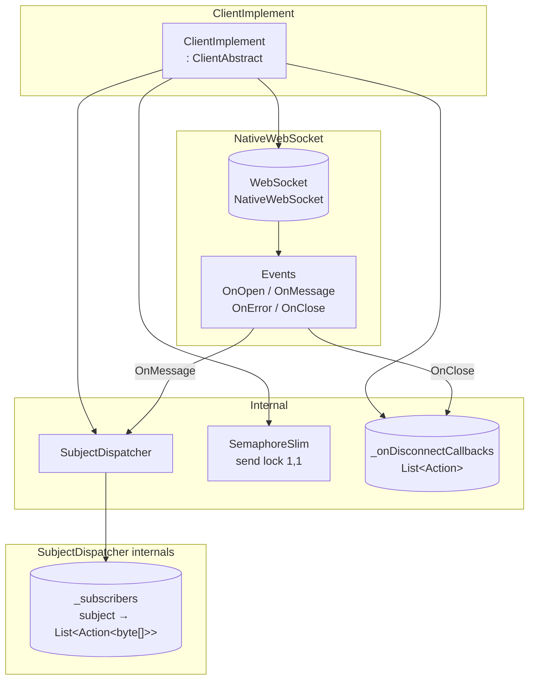
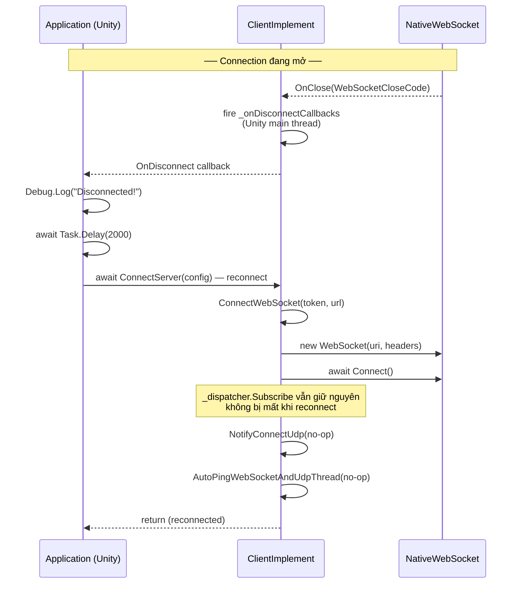
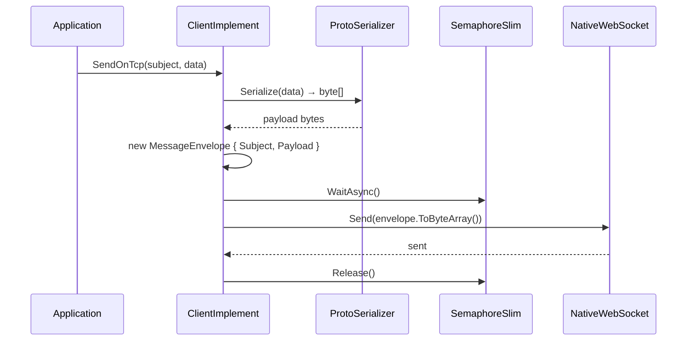
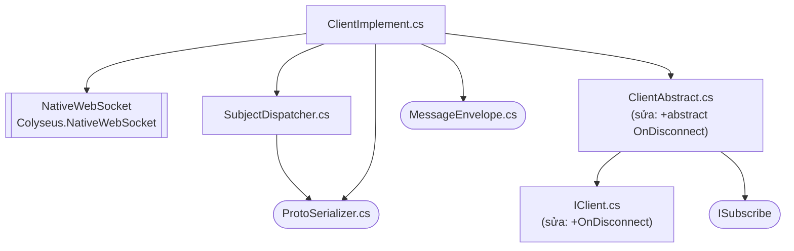

# Kế hoạch triển khai IClient

> **Cập nhật:** 2025-06-13 — Dùng `NativeWebSocket` (Colyseus.NativeWebSocket) cho Unity Client. Event-based receive, không ping thủ công, SemaphoreSlim send lock. Thêm `OnDisconnect` API cho reconnect.

## 1. Phạm vi

| File | Hành động | Trạng thái |
|------|-----------|------------|
| `src/IClient.cs` | Sửa | ✅ +`ISubscribe OnDisconnect(Action onDisconnect)` |
| `src/ClientAbstract.cs` | Sửa | ✅ +`abstract ISubscribe OnDisconnect(Action onDisconnect)` |
| `src/impl/ClientConfig.cs` | Không đụng | Config (`token`, `websocketServer`, `udpServer`) |
| `MyConnection.csproj` | Sửa | ✅ +`Colyseus.NativeWebSocket` 2.0.4 |
| `src/impl/ClientImplement.cs` | Sửa | ✅ Event-based, OnDisconnect, no-op UDP/ping, SemaphoreSlim lock |
| `src/impl/SubjectDispatcher.cs` | Tạo mới | ✅ Route subject → local callbacks |
| `src/impl/MessageEnvelope.cs` | Không đụng | Dùng chung với server |
| `src/impl/ProtoSerializer.cs` | Không đụng | Dùng chung với server |

**Không đụng vào:** `IServer`, `ServerAbstract`, `ServerImplement`, `ServerConfig`, `ServerTokenService`, `ConnectionImplement`, `ConnectionRegistry`, `WebSocketListener`, `IConnection`, `IUser`, `ISubscribe`

> **Unity note:** Trong Unity project, NativeWebSocket được cài qua UPM (`https://github.com/endel/NativeWebSocket.git#upm-2`). `MyConnection.csproj` chỉ thêm NuGet reference để biên dịch. Khi import vào Unity, NativeWebSocket phải có sẵn trong project Unity.

---

## 2. Kiến trúc tổng thể

```
ClientImplement : ClientAbstract
    │
    ├── WebSocket _ws                   // NativeWebSocket.WebSocket — 1 connection
    ├── SubjectDispatcher _dispatcher   // subject → [Action<TData>]
    │     └── _subscribers: subject → List<Action<byte[]>>
    ├── List<Action> _onDisconnectCallbacks  // fire khi ws.OnClose
    ├── object _gate                    // lock cho disconnect callbacks
    └── SemaphoreSlim _sendLock (1,1)   // serialize send (ClientWebSocket yêu cầu)

ConnectServer(config) [ClientAbstract template method]
  ├── await ConnectWebSocket(token, url)
  │     ├── Parse URL từ config.websocketServer
  │     ├── var headers = new Dictionary<string,string> { ["Authorization"] = "Bearer " + token }
  │     ├── _ws = new WebSocket(uri.ToString(), headers)
  │     ├── _ws.OnOpen += () => { }
  │     ├── _ws.OnMessage += (bytes) => parse MessageEnvelope → _dispatcher.Dispatch()
  │     ├── _ws.OnError += (err) => { }
  │     ├── _ws.OnClose += (code) => fire _onDisconnectCallbacks
  │     └── await _ws.Connect()
  ├── NotifyConnectUdp(token, udpServer)
  │     └── { } (no-op — không chặn reconnect)
  └── AutoPingWebSocketAndUdpThread()
        └── { } (no-op — WebSocket tự keepalive)

SendOnTcp<TData>(subject, data)
  ├── ProtoSerializer.Serialize(data) → byte[]
  ├── new MessageEnvelope { Subject, Payload }
  └── await _sendLock.WaitAsync() → _ws.Send(bytes) → Release()

OnDisconnect(callback)
  └── _onDisconnectCallbacks.Add(callback) → ISubscribe handle

SubscribeTcp<TData>(subject, callback)
  └── _dispatcher.Subscribe(subject, callback) → ISubscribe

OnMessage event (NativeWebSocket dispatch, Unity main thread)
  └── MessageEnvelope.Parser.ParseFrom(bytes)
        └── _dispatcher.Dispatch(subject, payload)
              └── foreach subscriber: Deserialize<TData> → callback(data)
```



### 2.1 Luồng kết nối (ConnectServer)

```mermaid
sequenceDiagram
    participant App as Application (Unity)
    participant CI as ClientImplement
    participant NW as NativeWebSocket<br/>WebSocket
    participant Server as Server<br/>WebSocketListener

    App->>CI: await ConnectServer(config)
    CI->>CI: ConnectWebSocket(token, url)
    CI->>CI: Parse URL → uri
    CI->>CI: headers = {"Authorization": "Bearer " + token}
    CI->>NW: new WebSocket(uri, headers)
    CI->>NW: đăng ký OnOpen / OnMessage / OnError / OnClose
    CI->>NW: await Connect()
    NW->>Server: TCP + HTTP upgrade<br/>Authorization: Bearer &lt;token&gt;

    alt token invalid
        Server-->>NW: HTTP 401
        NW-->>CI: OnError / exception
        CI-->>App: exception propagate
    else token valid
        Server-->>NW: HTTP 101 Switching Protocols
        NW-->>CI: OnOpen
        CI->>CI: NotifyConnectUdp(no-op)
        CI->>CI: AutoPingWebSocketAndUdpThread(no-op)
        CI-->>App: return (connected)
    end
```

### 2.2 Luồng disconnect + reconnect



### 2.3 Luồng gửi message (SendOnTcp)



### 2.4 Luồng nhận message (OnMessage event)

```mermaid
sequenceDiagram
    participant Server as Server
    participant NW as NativeWebSocket
    participant CI as ClientImplement
    participant DISP as SubjectDispatcher
    participant CB as Subscriber<br/>Action&lt;TData&gt;

    Server->>NW: MessageEnvelope { subject, payload }
    NW->>NW: nhận binary frame
    NW->>CI: OnMessage(bytes) — Unity main thread
    CI->>CI: MessageEnvelope.Parser.ParseFrom(bytes)
    alt parse lỗi
        CI->>CI: catch → ignore
    else parse OK
        CI->>DISP: Dispatch(subject, payload)
        DISP->>DISP: snapshot subscribers
        loop mỗi subscriber
            DISP->>DISP: ProtoSerializer.Deserialize&lt;TData&gt;(payload)
            DISP->>CB: callback(data)
        end
    end
```

---

## 3. Chi tiết từng file

### 3.1 `MyConnection.csproj`

Thêm 1 package reference (các package khác đã có sẵn):

```xml
<PackageReference Include="Colyseus.NativeWebSocket" Version="2.*" />
```

### 3.2 `src/impl/SubjectDispatcher.cs`

Giống server `ConnectionRegistry` phần local subscribers, nhưng đơn giản hơn: callback là `Action<TData>` (không có `IConnection` param), không có connection pool, không relay.

```csharp
using System.Collections.Concurrent;

namespace MyConnection;

public class SubjectDispatcher
{
    private readonly ConcurrentDictionary<string, List<Action<byte[]>>> _subscribers = new();

    public ISubscribe Subscribe<TData>(string subject, Action<TData> callback)
    {
        // Wrap: deserialize raw payload → TData → callback(data)
        // Action<byte[]> wrapped = rawPayload =>
        // {
        //     var data = ProtoSerializer.Deserialize<TData>(rawPayload);
        //     callback(data);
        // };
        // Thêm wrapped vào _subscribers[subject], lock per-list
        // Trả về ISubscribe gỡ callback khỏi list
    }

    public void Dispatch(string subject, byte[] payload)
    {
        // Tìm _subscribers[subject]
        // Snapshot list dưới lock → invoke outside lock
    }

    public void Clear()
    {
        // Xóa tất cả subscribers
    }

    // UnsubscribeHandle : ISubscribe (giống ConnectionRegistry)
}
```

### 3.3 `src/impl/ClientImplement.cs`

```csharp
using Google.Protobuf;
using NativeWebSocket;

namespace MyConnection;

public class ClientImplement : ClientAbstract
{
    private WebSocket? _ws;
    private readonly SubjectDispatcher _dispatcher = new();
    private readonly SemaphoreSlim _sendLock = new(1, 1);
    private readonly List<Action> _onDisconnectCallbacks = new();
    private readonly object _gate = new();

    // ── ConnectWebSocket ──
    protected override async Task ConnectWebSocket(string token, string websocketServer)
    {
        // Parse URL: nếu không có scheme → thêm "ws://"
        var uri = new Uri(
            websocketServer.Contains("://") ? websocketServer : "ws://" + websocketServer);

        var headers = new Dictionary<string, string>
        {
            ["Authorization"] = "Bearer " + token
        };
        _ws = new WebSocket(uri.ToString(), headers);

        _ws.OnOpen += () => { };
        _ws.OnMessage += OnMessage;
        _ws.OnError += (err) => { };
        _ws.OnClose += (code) =>
        {
            // fire disconnect callbacks trên Unity main thread
            Action[] snapshot;
            lock (_gate) { snapshot = _onDisconnectCallbacks.ToArray(); }
            foreach (var cb in snapshot) cb();
        };

        await _ws.Connect();
    }

    // ── OnMessage handler (chạy trên Unity main thread) ──
    private void OnMessage(byte[] data)
    {
        try
        {
            var envelope = MessageEnvelope.Parser.ParseFrom(data);
            _dispatcher.Dispatch(envelope.Subject, envelope.Payload.ToByteArray());
        }
        catch { /* invalid message, ignore */ }
    }

    // ── NotifyConnectUdp (no-op) ──
    protected override void NotifyConnectUdp(string token, string udpServer)
    {
        // no-op: không chặn reconnect, UDP chưa triển khai
    }

    // ── AutoPingWebSocketAndUdpThread (no-op) ──
    protected override void AutoPingWebSocketAndUdpThread()
    {
        // no-op: WebSocket tự keepalive, NativeWebSocket không expose Ping frame
    }

    // ── OnDisconnect ──
    public override ISubscribe OnDisconnect(Action callback)
    {
        lock (_gate) { _onDisconnectCallbacks.Add(callback); }
        return new UnsubscribeHandle(() =>
        {
            lock (_gate) { _onDisconnectCallbacks.Remove(callback); }
        });
    }

    // ── SendOnTcp ──
    public override async void SendOnTcp<TData>(string subject, TData data)
    {
        var payload = ProtoSerializer.Serialize(data);
        var envelope = new MessageEnvelope
        {
            Subject = subject,
            Payload = ByteString.CopyFrom(payload)
        };
        await _sendLock.WaitAsync();
        try
        {
            await _ws!.Send(envelope.ToByteArray());
        }
        finally
        {
            _sendLock.Release();
        }
    }

    // ── SendOnUdp (stub) ──
    public override void SendOnUdp<TData>(string subject, TData data)
        => throw new NotImplementedException("UDP not implemented yet");

    // ── SubscribeTcp ──
    public override ISubscribe SubscribeTcp<TData>(string subject, Action<TData> callback)
        => _dispatcher.Subscribe(subject, callback);

    // ── SubscribeUdp (stub) ──
    public override ISubscribe SubscribeUdp<TData>(string subject, Action<TData> data)
        => throw new NotImplementedException("UDP not implemented yet");

    // UnsubscribeHandle : ISubscribe (giống ConnectionRegistry)
}
```

---

## 4. Thứ tự triển khai

| # | Step | File | Trạng thái |
|---|------|------|------------|
| 1 | +`Colyseus.NativeWebSocket` NuGet | `MyConnection.csproj` | ✅ done |
| 2 | +`OnDisconnect` vào interface + abstract | `IClient.cs` → `ClientAbstract.cs` | ✅ done |
| 3 | Tạo SubjectDispatcher | `src/impl/SubjectDispatcher.cs` | ✅ done |
| 4 | Triển khai logic ClientImplement | `src/impl/ClientImplement.cs` | ✅ done |
| 5 | Build + verify | `dotnet build` | ✅ 0 errors |

---

## 5. Quyết định đã chốt

| Vấn đề | Quyết định | Lý do |
|--------|------------|-------|
| Thư viện WebSocket | **NativeWebSocket** (`Colyseus.NativeWebSocket`) | Unity-compatible, WebGL support, SynchronizationContext auto-dispatch |
| Generic constraint | **Không constraint** | `ProtoSerializer` cast `IMessage` runtime (dùng chung với server) |
| Wire format | **Dùng chung `MessageEnvelope`** | Tương thích server |
| Serialization | **Dùng chung `ProtoSerializer`** | Tương thích server |
| Transport ưu tiên | **WebSocket trước**, UDP stub | `SendOnUdp`/`SubscribeUdp` = `NotImplementedException` |
| Auth | **`Authorization: Bearer <token>`** qua constructor header | `new WebSocket(url, new Dictionary<string,string> { ["Authorization"] = ... })` |
| Send concurrency | **`SemaphoreSlim(1,1)`** lock | `ClientWebSocket` yêu cầu serialize `SendAsync`, NativeWebSocket không có internal queue |
| Ping | **No-op** | WebSocket tự keepalive, NativeWebSocket không expose Ping frame |
| Nhận message | **Event-based `OnMessage`** | NativeWebSocket dispatch qua `SynchronizationContext` → Unity main thread |
| `DispatchMessageQueue()` | **Không gọi** | Unity có `SynchronizationContext`, NativeWebSocket tự dispatch |
| `AutoPingWebSocketAndUdpThread` | **No-op `{ }`** | Không cần ping thủ công |
| `NotifyConnectUdp` | **No-op `{ }`** | Không chặn reconnect (nếu throw sẽ crash khi gọi `ConnectServer` lần 2) |
| `ConnectServer` flow | **Giữ nguyên template method** | `ConnectWebSocket` → `NotifyConnectUdp(no-op)` → `AutoPingWebSocketAndUdpThread(no-op)` |
| Disconnect detection | **`ISubscribe OnDisconnect(Action)`** | Mirror pattern `IServer.OnDisconnect`. NativeWebSocket `OnClose` → fire callbacks |
| Reconnect | **Gọi lại `ConnectServer(config)`** từ callback | Subject subscribers + OnDisconnect persist qua reconnect (không bị xóa khi tạo ws mới) |
| Subscribe callback | **`Action<TData>`** | Client nhận data thuần, không có `IConnection` param |
| Cleanup | **Không có `IAsyncDisposable`** | Interface không khai báo, cleanup qua Unity lifecycle (`OnDestroy`/`OnApplicationQuit`) |

---

## 6. Dependency giữa các file



Thứ tự code: `IClient` → `ClientAbstract` → `SubjectDispatcher` → `ClientImplement`

---

## 7. So sánh Client (NativeWebSocket) vs Server (System.Net.WebSockets)

| Khía cạnh | Server | Client (NativeWebSocket) |
|-----------|--------|--------------------------|
| WebSocket library | `System.Net.WebSockets` | **`NativeWebSocket`** (`Colyseus.NativeWebSocket`) |
| Connection | Nhiều (pool) | **1** (single WebSocket) |
| Auth | Validate JWT | **Gửi token** qua constructor `headers` param |
| Token service | `ServerTokenService` | **Không cần** |
| Connection model | `ConnectionImplement : IConnection` | **Không có IConnection** |
| Nhận message | Manual `ReceiveAsync` loop | **Event `OnMessage(byte[])`** |
| Thread dispatch | Tự quản lý | **SynchronizationContext** → Unity main thread |
| Gửi message | `SendAsync(ArraySegment<byte>, ...)` | **`Send(byte[])`** (đơn giản hơn) |
| Auth header | Parse HTTP request | **Constructor `headers` dict** |
| Subscribe callback | `Action<IConnection, TData>` | **`Action<TData>`** (chỉ data) |
| Disconnect event | `OnDisconnect(Action<IConnection>)` | **`OnDisconnect(Action)`** (không param) |
| Ping | Cập nhật `WebSocketPingTime` | **No-op** (WebSocket tự keepalive) |
| Cleanup | `IAsyncDisposable` | **Unity lifecycle** (`OnDestroy`) |
| NuGet package | `Google.Protobuf`, JWT | **+ `Colyseus.NativeWebSocket`** |
