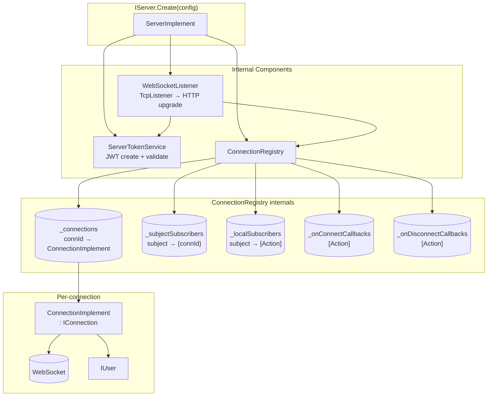
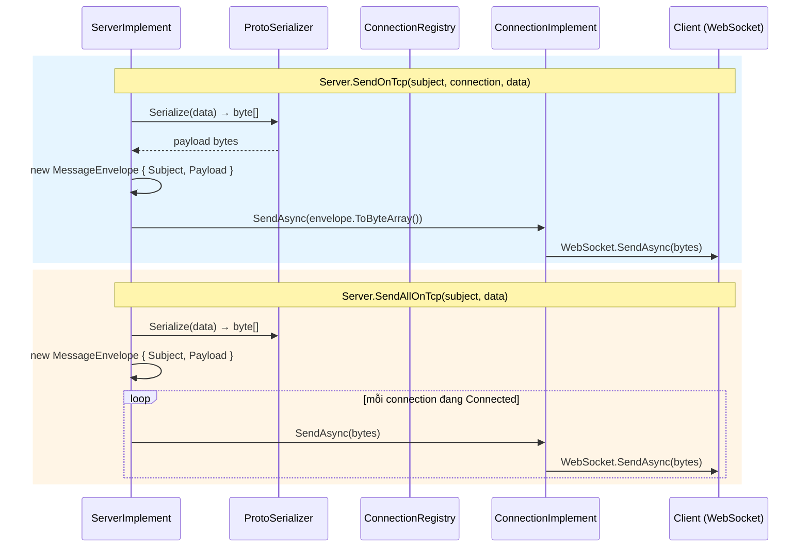
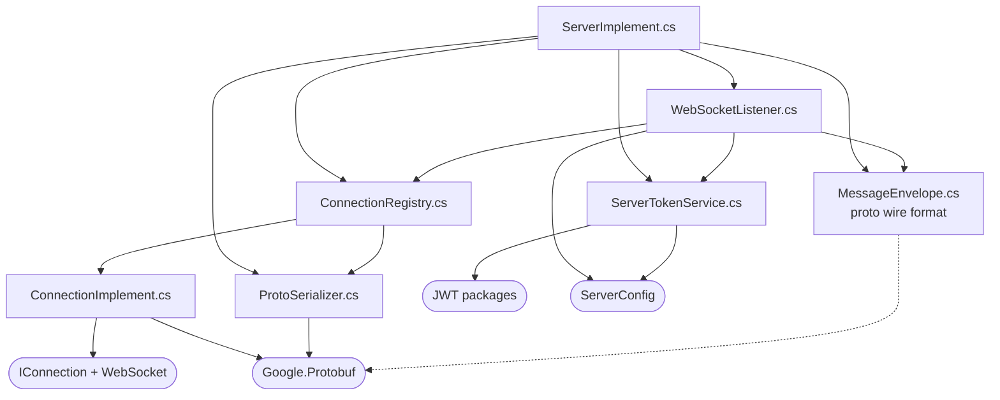

# Kế hoạch triển khai IServer

> **Cập nhật:** 2025-06-13 — IServer đã được user bổ sung `Connections`, `OnConnect`, `OnDisconnect`, `IAsyncDisposable`, bỏ generic constraint.

## 1. Phạm vi

| File | Hành động | Trạng thái |
|------|-----------|------------|
| `src/IServer.cs` | ~~Sửa~~ | **Đã xong** — `: IAsyncDisposable` |
| `src/ServerAbstract.cs` | ~~Sửa~~ | **Đã xong** — `abstract ValueTask DisposeAsync()` |
| `src/impl/ServerImplement.cs` | Sửa | Stub đã có `DisposeAsync()`, cần triển khai logic |
| `MyConnection.csproj` | Sửa | Thêm 4 NuGet packages |
| `src/impl/MessageEnvelope.cs` | Tạo mới | Wire format chung cho WebSocket |
| `src/impl/ProtoSerializer.cs` | Tạo mới | Helper serialize/deserialize (runtime IMessage, không constraint) |
| `src/impl/ServerTokenService.cs` | Tạo mới | JWT create + validate |
| `src/impl/ConnectionImplement.cs` | Tạo mới | Implement IConnection, wrap WebSocket |
| `src/impl/ConnectionRegistry.cs` | Tạo mới | Connection pool + subject routing + connect/disconnect events |
| `src/impl/WebSocketListener.cs` | Tạo mới | Accept WebSocket connections |

**Không đụng vào:** `IClient`, `ClientAbstract`, `ClientImplement`, `IConnection`, `IUser`, `ISubscribe`, `ClientConfig`, `ServerConfig`, `Class1`

---

## 2. Kiến trúc tổng thể

```
IServer.Create(ServerConfig)
  └── ServerImplement : ServerAbstract, IAsyncDisposable
        ├── ServerTokenService            // JWT (secret, audience, issuer từ config)
        ├── ConnectionRegistry            // ConcurrentDictionary: connection + subject + events
        │     ├── _connections            // connectionId → ConnectionImplement
        │     ├── _subjectSubscribers     // subject → {connectionId} (relay)
        │     ├── _localSubscribers       // subject → [Action<IConnection,TData>] (local)
        │     ├── _onConnectCallbacks     // [Action<IConnection>]
        │     └── _onDisconnectCallbacks  // [Action<IConnection>]
        └── WebSocketListener             // TcpListener → HTTP upgrade → WebSocket
              └── On new connection:
                    ├── Validate JWT từ Authorization header
                    ├── Tạo ConnectionImplement(Id=Guid, User, WebSocketSessionId)
                    ├── Registry.Register(connection) → fire OnConnect callbacks
                    └── Receive loop → parse MessageEnvelope → route by subject
                          └── On close/error → Registry.Remove(id) → fire OnDisconnect callbacks

DisposeAsync()
  ├── _cts.Cancel()
  ├── await _listener.StopAsync()    // Đóng tất cả WebSocket + TcpListener
  └── _cts.Dispose()
```



### 2.1 Vòng đời kết nối (Connection Lifecycle)

```mermaid
sequenceDiagram
    participant C as Client
    participant WL as WebSocketListener
    participant STS as ServerTokenService
    participant REG as ConnectionRegistry
    participant CB as OnConnect/OnDisconnect callbacks

    C->>WL: TCP connect + HTTP upgrade request<br/>Authorization: Bearer &lt;token&gt;
    WL->>STS: ValidateToken(token)
    alt token invalid
        STS-->>WL: null
        WL-->>C: HTTP 401 Unauthorized<br/>close TCP
    else token valid
        STS-->>WL: ClaimsPrincipal (user)
        WL->>WL: WebSocket handshake<br/>HTTP 101 Switching Protocols
        WL->>WL: Create ConnectionImplement(ws, user)
        WL->>REG: Register(connection)
        REG->>CB: Fire OnConnect(connection)
        Note over REG,CB: callback chạy đồng bộ<br/>nhiều handler cùng lắng nghe

        loop Receive loop
            C->>WL: MessageEnvelope { Subject, Payload }
            WL->>WL: Cập nhật WebSocketPingTime
            WL->>REG: Route(subject, senderConn, payload)
            REG->>REG: Deserialize → local callbacks
            REG->>REG: Forward → other subscribers
        end

        C--xWL: WebSocket close / error
        WL->>REG: Remove(connectionId)
        REG->>CB: Fire OnDisconnect(connection)
    end
```

### 2.2 Luồng gửi / nhận message



### 2.3 Luồng nhận message (inbound) + routing

```mermaid
sequenceDiagram
    participant C as Client A (sender)
    participant WL as WebSocketListener
    participant REG as ConnectionRegistry
    participant LCB as Local Subscriber<br/>Action&lt;IConnection, TData&gt;
    participant Other as Client B, C... (subscribers)

    C->>WL: MessageEnvelope { subject: "chat", payload: [...] }
    WL->>WL: Cập nhật WebSocketPingTime
    WL->>REG: Route(senderId, "chat", payload)

    par Local dispatch
        REG->>REG: Tìm local subscribers của "chat"
        REG->>REG: Deserialize payload → TData
        REG->>LCB: callback(senderConnection, data)
        Note over REG,LCB: nhiều handler cùng nhận<br/>chạy tuần tự, đồng bộ
    and Relay to other connections
        REG->>REG: Tìm connections subscribe "chat"
        loop mỗi connection khác sender
            REG->>Other: SendAsync(envelope bytes)
        end
    end
```

### 2.4 Các API bổ sung

| API | Hành vi |
|-----|---------|
| `Connections` (property) | Trả về `_registry.GetAll()` → `IReadOnlyCollection<IConnection>` |
| `OnConnect(callback)` | Trả về `ISubscribe` handle. Callback chạy khi connection được Register |
| `OnDisconnect(callback)` | Trả về `ISubscribe` handle. Callback chạy khi connection bị Remove |

### 2.5 Generic constraint strategy

Interface không có constraint (`TData` tự do). Implementation kiểm tra tại runtime:

```
SendOnTcp<TData>(data)
  └── var msg = data as IMessage ?? throw InvalidOperationException("TData must implement IMessage")
  └── ProtoSerializer.Serialize(msg) → byte[]

SubscribeTcp<TData>(callback)
  └── Registry.SubscribeLocal(subject, (conn, rawPayload) => {
        var msg = Activator.CreateInstance<TData>();
        ((IMessage)msg).MergeFrom(new CodedInputStream(rawPayload));
        callback(conn, msg);
      })
```

---

## 3. Chi tiết từng file

### 3.1 `MyConnection.csproj`

```xml
<Project Sdk="Microsoft.NET.Sdk">
  <PropertyGroup>
    <TargetFramework>net9.0</TargetFramework>
    <ImplicitUsings>enable</ImplicitUsings>
    <Nullable>enable</Nullable>
  </PropertyGroup>
  <ItemGroup>
    <PackageReference Include="Google.Protobuf" Version="3.34.1" />
    <PackageReference Include="Grpc.Tools" Version="2.80.0">
      <PrivateAssets>all</PrivateAssets>
      <IncludeAssets>runtime; build; native; contentfiles; analyzers; buildtransitive</IncludeAssets>
    </PackageReference>
    <PackageReference Include="Microsoft.IdentityModel.Tokens" Version="8.*" />
    <PackageReference Include="System.IdentityModel.Tokens.Jwt" Version="8.*" />
  </ItemGroup>
</Project>
```

### 3.2 `src/IServer.cs` — ĐÃ HOÀN THÀNH (`: IAsyncDisposable`)

```csharp
namespace MyConnection
{
    public interface IServer : IAsyncDisposable
    {
        public static IServer Create(ServerConfig config)
        {
            throw new NotImplementedException();
        }
        IReadOnlyCollection<IConnection> Connections { get; }
        string CreateToken(string id, string name);
        IConnection GetConnectionById(string id);
        ISubscribe OnConnect(Action<IConnection> onConnect);
        ISubscribe OnDisconnect(Action<IConnection> onDisconnect);
        void SendOnUdp<TData>(string subject, IConnection connection, TData data);
        void SendOnTcp<TData>(string subject, IConnection connection, TData data);
        void SendAllOnUdp<TData>(string subject, TData data);
        void SendAllOnTcp<TData>(string subject, TData data);
        ISubscribe SubscribeUdp<TData>(string subject, Action<IConnection, TData> data);
        ISubscribe SubscribeTcp<TData>(string subject, Action<IConnection, TData> data);
    }
}
```

### 3.3 `src/impl/MessageEnvelope.cs`

Wire format cho mọi message trên WebSocket. Implement `IMessage<MessageEnvelope>` thủ công (không cần `.proto` file, không phụ thuộc `Grpc.Tools` runtime):

```csharp
// Fields:
//   Subject  = 1  (string)  - tên subject pub/sub
//   Payload  = 2  (bytes)   - dữ liệu đã serialize (protobuf của TData)

// Implement:
//   static MessageParser<MessageEnvelope> Parser
//   MessageEnvelope() / MessageEnvelope(MessageEnvelope other)
//   void WriteTo(CodedOutputStream) 
//   void MergeFrom(CodedInputStream)
//   int CalculateSize()
//   MessageEnvelope Clone()
//   bool Equals(MessageEnvelope other)
```

### 3.4 `src/impl/ProtoSerializer.cs`

Không dùng generic constraint (vì interface không có). Kiểm tra `IMessage` tại runtime:

```csharp
public static class ProtoSerializer
{
    // Serialize: cast T → IMessage, throw nếu không implement
    public static byte[] Serialize<T>(T message)
    {
        var msg = (message as IMessage) ?? throw new InvalidOperationException(
            $"TData '{typeof(T).Name}' must implement Google.Protobuf.IMessage");
        return msg.ToByteArray();
    }

    // Deserialize: Activator.CreateInstance → IMessage.MergeFrom
    public static T Deserialize<T>(byte[] data)
    {
        var instance = Activator.CreateInstance<T>();
        var msg = (instance as IMessage) ?? throw new InvalidOperationException(
            $"TData '{typeof(T).Name}' must implement Google.Protobuf.IMessage");
        msg.MergeFrom(new CodedInputStream(data));
        return instance;
    }
}
```

### 3.5 `src/impl/ServerTokenService.cs`

```csharp
public class ServerTokenService
{
    private readonly JwtSecurityTokenHandler _handler;
    private readonly SigningCredentials _credentials;
    private readonly TokenValidationParameters _validationParams;

    public ServerTokenService(ServerConfig config)
    {
        // _handler = new JwtSecurityTokenHandler()
        // Tạo symmetric key từ config.jwtSecret (HMAC-SHA256)
        // _credentials = new SigningCredentials(key, SecurityAlgorithms.HmacSha256)
        // _validationParams = TokenValidationParameters với ValidateIssuer, ValidateAudience, ValidateLifetime...
    }

    public string CreateToken(string id, string name)
    {
        // JWT claims: sub=id, name=name, jti=Guid.NewGuid(), exp=now+24h
        // Token có audience và issuer từ config
    }

    public ClaimsPrincipal? ValidateToken(string token)
    {
        // _handler.ValidateToken(token, _validationParams, out _)
        // Trả về null nếu exception
    }
}
```

### 3.6 `src/impl/ConnectionImplement.cs`

```csharp
public class ConnectionImplement : IConnection
{
    public string Id { get; }                          // Guid.NewGuid().ToString("N")
    public IUser User { get; }                          // Từ token claims
    public IDictionary<string, object> Attributes { get; }        // Mutable, thread-safe
    public bool Connected { get; }                      // WebSocket.State == Open
    public string UdpAddress { get; }                   // "" (chưa có UDP)
    public string WebSocketSessionId { get; }           // Guid.NewGuid().ToString("N")
    public long UdpPingTime { get; set; }               // 0 (chưa có UDP)
    public long WebSocketPingTime { get; set; }         // Unix ms, cập nhật mỗi lần nhận message

    internal readonly WebSocket _webSocket;             // WebSocket instance
    internal readonly ConcurrentDictionary<string, object> _attributes;

    // Constructor(WebSocket, IUser) → tự sinh Id, WebSocketSessionId
    // internal async Task SendAsync(byte[] data) → _webSocket.SendAsync(...)
    // internal async Task CloseAsync() → _webSocket.CloseAsync(...)
}
```

### 3.7 `src/impl/ConnectionRegistry.cs`

```csharp
public class ConnectionRegistry
{
    // ── Dữ liệu ──
    // ConcurrentDictionary<string, ConnectionImplement> _connections
    // ConcurrentDictionary<string, ConcurrentDictionary<string, byte>> _subjectSubscribers
    //   (subject → {connectionId → 0 placeholder})
    // ConcurrentDictionary<string, ConcurrentBag<Delegate>> _localSubscribers
    //   (subject → list of Action<IConnection, TData> callbacks)
    // ConcurrentBag<Action<IConnection>> _onConnectCallbacks     ← MỚI
    // ConcurrentBag<Action<IConnection>> _onDisconnectCallbacks  ← MỚI

    // ── Connection management ──
    public void Register(ConnectionImplement connection)
    {
        // _connections[id] = connection
        // foreach callback in _onConnectCallbacks → callback(connection)
    }
    public void Remove(string connectionId)
    {
        // Xóa connection khỏi _connections
        // Xóa connectionId khỏi tất cả subject trong _subjectSubscribers
        // foreach callback in _onDisconnectCallbacks → callback(connection)
    }
    public ConnectionImplement? GetById(string id);
    public IReadOnlyCollection<ConnectionImplement> GetAll();     // ← MỚI: cho property Connections

    // ── Subject subscription (relay giữa các connection) ──
    public void SubscribeConnection(string connectionId, string subject);
    public void UnsubscribeConnection(string connectionId, string subject);

    // ── Local subscription (server-side handler) ──
    public ISubscribe SubscribeLocal<TData>(string subject, Action<IConnection, TData> callback)
    {
        // Wrap callback: deserialize raw payload → TData bằng ProtoSerializer
        // Thêm wrapped callback vào _localSubscribers[subject]
        // Trả về ISubscribe gỡ callback khi UnSubscribe()
    }

    // ── Connect / Disconnect events ← MỚI ──
    public ISubscribe OnConnect(Action<IConnection> callback)
    {
        // Thêm callback vào _onConnectCallbacks
        // Trả về ISubscribe gỡ callback khi UnSubscribe()
    }
    public ISubscribe OnDisconnect(Action<IConnection> callback)
    {
        // Thêm callback vào _onDisconnectCallbacks
        // Trả về ISubscribe gỡ callback khi UnSubscribe()
    }

    // ── Routing ──
    public void Route(string senderConnectionId, string subject, byte[] payload)
    {
        // 1. Deserialize + gọi local subscribers của subject
        // 2. Forward payload đến các connection khác subscribe subject
    }

    // ── Cleanup ──
    public void Clear();
}
```

### 3.8 `src/impl/WebSocketListener.cs`

```csharp
public class WebSocketListener
{
    private readonly ServerConfig _config;
    private readonly ServerTokenService _tokenService;
    private readonly ConnectionRegistry _registry;
    private TcpListener? _listener;
    private CancellationTokenSource? _cts;

    // Constructor(ServerConfig, ServerTokenService, ConnectionRegistry)
    
    public async Task StartAsync(CancellationToken ct)
    {
        // Parse host:port từ _config.websocketEndpoint
        // _listener = new TcpListener(IPAddress.Any, port)
        // _listener.Start()
        // Accept loop trong Task:
        //   foreach TcpClient:
        //     Task.Run(() => HandleConnection(tcpClient))
    }

    private async Task HandleConnection(TcpClient tcpClient)
    {
        // 1. Đọc HTTP request từ NetworkStream (chỉ đọc đủ để parse headers)
        //    → Tìm "Authorization: Bearer <token>" header
        //    → ValidateToken → nếu fail: trả 401 "Unauthorized" + close
        // 2. Tìm "Sec-WebSocket-Key" header → compute accept key (SHA1 + Base64)
        //    → Gửi HTTP 101 Switching Protocols response
        // 3. Tạo WebSocket từ NetworkStream:
        //    WebSocket.CreateFromStream(networkStream, isServer: true, ...)
        // 4. Tạo ConnectionImplement(webSocket, user)
    // 5. _registry.Register(connection)  →  tự động fire OnConnect callbacks
    // 6. Receive loop:
    //    while webSocket.State == Open:
    //      Nhận message → MessageEnvelope.Parser.ParseFrom(...)
    //      Cập nhật connection.WebSocketPingTime
    //      _registry.Route(connection.Id, envelope.Subject, envelope.Payload.ToByteArray())
    // 7. Khi close/exception → _registry.Remove(connection.Id)  →  tự động fire OnDisconnect callbacks
    }

    public async ValueTask StopAsync()
    {
        _cts?.Cancel();
        _listener?.Stop();
        _registry.Clear();
        // Đóng tất cả WebSocket connection đang mở
    }
}
```

### 3.9 `src/impl/ServerImplement.cs`

```csharp
public class ServerImplement : ServerAbstract
{
    private readonly ServerConfig _config;
    private readonly ServerTokenService _tokenService;
    private readonly ConnectionRegistry _registry;
    private readonly WebSocketListener _listener;
    private readonly CancellationTokenSource _cts;

    private ServerImplement(ServerConfig config)
    {
        _config = config;
        _cts = new CancellationTokenSource();
        _tokenService = new ServerTokenService(config);
        _registry = new ConnectionRegistry();
        _listener = new WebSocketListener(config, _tokenService, _registry);
    }

    // ── IServer.Create (static factory) ──
    public static new IServer Create(ServerConfig config)
    {
        var server = new ServerImplement(config);
        _ = server._listener.StartAsync(server._cts.Token);
        return server;
    }

    // ── Connections (property) ──
    public override IReadOnlyCollection<IConnection> Connections
        => _registry.GetAll();

    // ── Connect / Disconnect events ──
    public override ISubscribe OnConnect(Action<IConnection> callback)
        => _registry.OnConnect(callback);

    public override ISubscribe OnDisconnect(Action<IConnection> callback)
        => _registry.OnDisconnect(callback);

    // ── Token ──
    public override string CreateToken(string id, string name)
        => _tokenService.CreateToken(id, name);

    // ── Connection lookup ──
    public override IConnection GetConnectionById(string id)
        => _registry.GetById(id) ?? throw new KeyNotFoundException($"Connection {id} not found");

    // ── Send ──
    public override void SendOnUdp<TData>(string subject, IConnection connection, TData data)
        => throw new NotImplementedException("UDP not implemented yet");

    public override async void SendOnTcp<TData>(string subject, IConnection connection, TData data)
    {
        var payload = ProtoSerializer.Serialize(data);   // runtime IMessage cast
        var envelope = new MessageEnvelope { Subject = subject, Payload = ByteString.CopyFrom(payload) };
        var conn = (ConnectionImplement)connection;
        await conn.SendAsync(envelope.ToByteArray());
    }

    public override void SendAllOnUdp<TData>(string subject, TData data)
        => throw new NotImplementedException("UDP not implemented yet");

    public override async void SendAllOnTcp<TData>(string subject, TData data)
    {
        var payload = ProtoSerializer.Serialize(data);   // runtime IMessage cast
        var envelope = new MessageEnvelope { Subject = subject, Payload = ByteString.CopyFrom(payload) };
        var bytes = envelope.ToByteArray();
        foreach (var conn in _registry.GetAll())
        {
            if (conn.Connected)
                await conn.SendAsync(bytes);
        }
    }

    // ── Subscribe ──
    public override ISubscribe SubscribeUdp<TData>(string subject, Action<IConnection, TData> data)
        => throw new NotImplementedException("UDP not implemented yet");

    public override ISubscribe SubscribeTcp<TData>(string subject, Action<IConnection, TData> callback)
        => _registry.SubscribeLocal(subject, callback);

    // ── DisposeAsync ──
    public override async ValueTask DisposeAsync()
    {
        _cts.Cancel();
        await _listener.StopAsync();
        _cts.Dispose();
        GC.SuppressFinalize(this);
    }
}
```
---

## 4. Thứ tự triển khai

| # | Step | File | Trạng thái |
|---|------|------|------------|
| 1 | Thêm NuGet packages | `MyConnection.csproj` | ⬜ chưa |
| 2 | Thêm `IAsyncDisposable` | `src/IServer.cs` | ✅ đã xong |
| 3 | Thêm `DisposeAsync()` abstract | `src/ServerAbstract.cs` | ✅ đã xong |
| 4 | Thêm `DisposeAsync()` stub | `src/impl/ServerImplement.cs` | ✅ đã xong |
| 5 | Wire format protobuf | `src/impl/MessageEnvelope.cs` | ⬜ chưa |
| 6 | Helper serialize/deserialize (runtime IMessage) | `src/impl/ProtoSerializer.cs` | ⬜ chưa |
| 7 | JWT service | `src/impl/ServerTokenService.cs` | ⬜ chưa |
| 8 | Connection implementation | `src/impl/ConnectionImplement.cs` | ⬜ chưa |
| 9 | Registry (pool + routing + events) | `src/impl/ConnectionRegistry.cs` | ⬜ chưa |
| 10 | WebSocket listener (có `StopAsync()`) | `src/impl/WebSocketListener.cs` | ⬜ chưa |
| 11 | Triển khai logic ServerImplement | `src/impl/ServerImplement.cs` | ⬜ chưa |
| 12 | Build + verify | `dotnet build` | ⬜ chưa |

---

## 5. Quyết định đã chốt

| Vấn đề | Quyết định |
|--------|------------|
| Generic constraint | **Không constraint trên interface**. Implementation cast `data as IMessage` tại runtime, throw `InvalidOperationException` nếu không implement |
| Connection ID | Guid tự sinh (session-based) |
| Transport ưu tiên | **WebSocket trước**, UDP để lại stub (NotImplementedException) |
| IServer lifetime | **`IAsyncDisposable`**. `DisposeAsync()` → Cancel token → `await StopAsync()` → Dispose resources |
| Auth handshake | `Authorization: Bearer <token>` HTTP header |
| IConnection trong callback | Connection của người gửi message |
| Phạm vi sửa file | Chỉ IServer + ServerAbstract + ServerImplement + file mới trong impl/ |
| Connections property | Trả về toàn bộ connection đang active từ registry |
| OnConnect / OnDisconnect | `ISubscribe` handle. Callback fire khi Registry.Register / Registry.Remove |

---

## 6. Dependency giữa các file mới



Thứ tự code phải theo dependency từ trên xuống.
